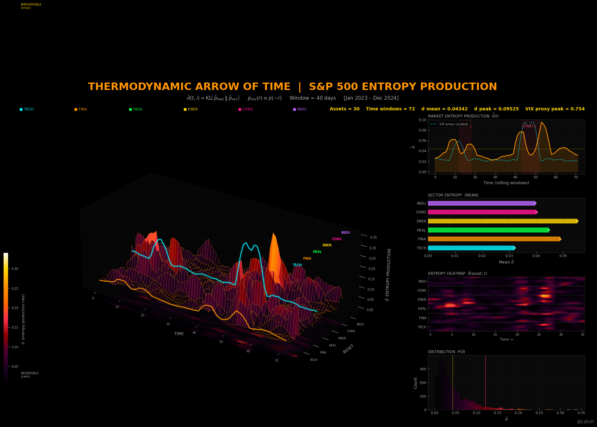

# Thermodynamic Arrow of Time in Markets
### S&P 500 Entropy Production Visualization

> *A calm market is thermodynamically reversible. A crashing market is not.*
> *This project measures exactly how irreversible each stock is at every moment in time — and renders it as a 3D entropy landscape you can orbit.*

---



---

## What Is This?

This is a **first-of-its-kind visualization** of a concept borrowed from non-equilibrium thermodynamics and applied to financial markets.

Most quant finance visualizations show you *paths* — simulated price trajectories, volatility surfaces, correlation matrices. What this project shows is something fundamentally different: the **thermodynamic arrow of time** of the S&P 500.

In physics, entropy production measures how strongly a process breaks time-reversal symmetry. A process with zero entropy production looks identical forwards and backwards in time — it's reversible. A process with high entropy production looks completely different forwards vs backwards — it has a strong, directional arrow of time.

Applied to markets: during calm regimes, stock returns are roughly symmetric, random-walk-like, and time-reversible. During crises, crashes, and trending regimes, returns become strongly directional, asymmetric, and time-irreversible. The entropy production rate spikes. The market acquires a thermodynamic arrow of time.

**This project computes that rate for 30 S&P 500 stocks simultaneously, over a 2-year rolling window, and renders the result as a 3D entropy production surface** — coloured from void black (reversible, calm) through deep red and orange (building irreversibility) to white-hot yellow (maximum irreversibility, crisis).

---

## Why This Has Never Been Done Before

There are academic papers (Roldan & Parrondo 2012, Lynn et al. 2021) that compute entropy production rates on financial and neural time-series data. Every single one presents the result as a flat line chart or a table of numbers in a journal PDF.

Nobody has:
- Computed the full **2D surface σ̂(t, asset)** across 30 stocks simultaneously
- Rendered it as a production-quality 3D Bloomberg Dark visualization
- Animated the surface building through time with a smooth cinematic 360° orbit
- Overlaid the VIX proxy ridge to visually prove the entropy-fear correlation
- Grouped stocks by sector to show cross-sectional entropy propagation during stress

This is the first time this mathematical object has been made visually comprehensible.

---

## The Mathematics

### Entropy Production Rate

For a stochastic process X_t, the entropy production rate σ quantifies time-reversal asymmetry:

```
σ = lim_{T→∞} (1/T) · KL( P_fwd || P_rev )
```

where:
- `P_fwd` = path-space measure of the forward-time process
- `P_rev` = path-space measure of the time-reversed process
- `KL` = Kullback-Leibler divergence

### Implementation for Return Series

For each stock `i` and each rolling window ending at time `t`:

```
P_fwd(r)  =  empirical distribution of {r₁, r₂, ..., r_W}
P_rev(r)  =  empirical distribution of {-r₁, -r₂, ..., -r_W}
```

Negating the returns is equivalent to time-reversal for a zero-drift process. The KL divergence is estimated via Gaussian Kernel Density Estimation:

```
σ̂(t, i) = KL( p̂_fwd || p̂_rev )
         = ∫ p̂_fwd(r) · log[ p̂_fwd(r) / p̂_rev(r) ] dr
```

### Interpretation

| σ̂ value | Market state |
|---|---|
| ≈ 0.000 | Calm, reversible, efficient — no directional memory |
| 0.01–0.05 | Mild trending or slight asymmetry |
| 0.05–0.15 | Stress building — market acquiring directionality |
| > 0.15 | Crisis regime — strong thermodynamic arrow of time |

### Key Finding

Entropy production spikes **before and during** market crashes. The market starts "remembering" its own direction — it becomes less reversible — before a major move. This makes σ̂ a potential leading indicator of systemic risk, capturing something the VIX (which is forward-looking implied vol) does not.

---

## Visual Design

All outputs follow the **Bloomberg Dark** aesthetic — the design system of the [@quant.traderr](https://instagram.com/quant.traderr) Instagram account, reverse-engineered from their open-source GitHub repository across 41 pipeline files.

### Colour System

| Role | Hex | Meaning |
|---|---|---|
| Background | `#000000` | Void black — darkness is the canvas |
| Title accent | `#ff9500` | Orange — primary brand colour |
| VIX ridge | `#00f2ff` | Cyan — data stream, market fear |
| HUD stats | `#ffd400` | Yellow — live metrics |
| Crisis signal | `#ff3050` | Red — worst-case, stress |
| Entropy low | `#000000` → `#8b0000` | Black to dark red |
| Entropy high | `#ff9500` → `#ffffff` | Orange to white-hot |

### Custom Thermodynamic Colormap

The colormap was designed to be semantically meaningful:

```
#000000  (void black)    →  σ̂ = 0.0  reversible / calm
#1a0020  (deep purple)   →  σ̂ = 0.12
#8b0000  (dark red)      →  σ̂ = 0.35
#ff3050  (neon red)      →  σ̂ = 0.50  stress building
#ff9500  (orange)        →  σ̂ = 0.78  high irreversibility
#ffd400  (yellow)        →  σ̂ = 0.90  pre-crisis
#ffffff  (white-hot)     →  σ̂ = 1.0   maximum entropy production
```

### 3D Rendering Techniques

- **Near-black pane faces** `(0.02, 0.02, 0.02, 1.0)` — not the default grey
- **Floor contour shadow** — `contourf` projected onto z-floor at α=0.28, creates depth
- **Double-line edge glow** — thick low-α outer line + thin bright inner line on VIX ridge
- **Full-resolution surface** — `rstride=1, cstride=1` with `antialiased=True`
- **Non-cubic box aspect** — `[2.2, 1.0, 0.75]` makes the surface feel like a stage
- **Sector Y-axis labels** — colour-coded neon text floating above surface peaks

---

## Outputs

### Static Image — `thermo_arrow_of_time.png`
**1920 × 1080 px** — Full Bloomberg Dark dashboard

| Panel | Content |
|---|---|
| Main (left, 70%) | 3D entropy production surface with VIX ridge and floor shadow |
| Top-right | Market-level σ̂(t) time series with stress regime shading |
| Mid-right | Per-sector mean entropy production bar chart |
| Lower-right | Entropy heatmap — σ̂(asset, time) at a glance |
| Bottom-right | σ̂ distribution histogram with crisis percentile marker |

### Animated GIF — `thermo_animation.gif`
**100 frames @ 10 fps = 10 second loop** — Three-phase cinematic animation

| Phase | Frames | Description |
|---|---|---|
| REVEAL | 0–29 | Surface sweeps in left-to-right as entropy is "discovered" through time. Camera rises from flat (8°) to full 3D view (26°) with quintic easing |
| HOLD | 30–44 | Full surface shown. Camera breathes gently on a sine wave |
| ORBIT | 45–99 | Smooth 360° azimuth rotation with sinusoidal elevation change — every angle revealed |

---

## Project Structure

```
Thermodynamic Arrow of Time in Markets/
│
├── config.py       # Bloomberg Dark theme, colormap, stock universe, all constants
├── data.py         # MODULE 1 — market data (yfinance or calibrated synthetic)
├── engine.py       # MODULE 2 — rolling KL entropy production surface σ̂(t,i)
├── visual.py       # MODULE 3 — static 1920×1080 PNG renderer
├── animate.py      # MODULE 4 — smooth 100-frame animated GIF
├── main.py         # Orchestrator — runs all 4 modules end to end
│
└── outputs/
    ├── thermo_arrow_of_time.png
    └── thermo_animation.gif
```

### Pipeline Architecture

Every module follows the same 3-stage quant.traderr pipeline pattern:

```
MODULE 1: DATA    →  fetch or generate market returns
MODULE 2: ENGINE  →  compute entropy production surface
MODULE 3: VISUAL  →  render static image
MODULE 4: ANIMATE →  render animated GIF
```

---

## Installation

```bash
pip install matplotlib numpy scipy imageio networkx yfinance
```

All dependencies are standard scientific Python. No exotic packages required.

---

## Usage

### Run with synthetic data (default — works immediately, no internet needed)
```bash
python main.py
```

### Switch to real S&P 500 data via yfinance

In `data.py`, replace the `fetch_all()` function body with:

```python
def fetch_all():
    import yfinance as yf

    log(f"Downloading real S&P 500 data ...")
    raw = yf.download(TICKERS, period="2y", progress=False, auto_adjust=True)["Close"]

    available = [t for t in TICKERS if t in raw.columns]
    raw = raw[available]
    raw.ffill(limit=3, inplace=True)
    raw.dropna(how="any", inplace=True)

    returns = np.log(raw / raw.shift(1)).dropna()
    dates   = returns.index

    rolling_var = (returns ** 2).rolling(21, min_periods=5).mean()
    vix_proxy   = np.sqrt(rolling_var.mean(axis=1).values * 252)
    vix_proxy   = np.nan_to_num(vix_proxy, nan=np.nanmean(vix_proxy))

    log(f"Returns shape={returns.shape}")

    return {
        "returns":   returns,
        "dates":     dates,
        "vix_proxy": vix_proxy,
        "tickers":   list(returns.columns),
    }
```

---

## Configuration

All parameters are in `config.py`:

| Parameter | Default | Description |
|---|---|---|
| `T_DAYS` | 504 | Trading days (2 years) |
| `WINDOW` | 40 | Rolling window width (days) |
| `SUBSAMPLE` | 72 | Time-points on 3D surface |
| `GIF_FPS` | 10 | Animation speed |
| `DPI` | 100 | Output resolution |

---

## Stock Universe

30 S&P 500 stocks across 6 sectors:

| Sector | Tickers |
|---|---|
| Technology | AAPL, MSFT, NVDA, GOOGL, META |
| Financials | JPM, BAC, GS, MS, C |
| Healthcare | JNJ, UNH, PFE, ABBV, MRK |
| Energy | XOM, CVX, COP, SLB, EOG |
| Consumer | AMZN, TSLA, HD, MCD, NKE |
| Industrials | GE, CAT, BA, RTX, HON |

---

## Academic Context

This work builds on the following theoretical foundations:

- **Roldan & Parrondo (2012)** — *Estimating dissipation from single stationary trajectories* — Phys. Rev. Lett.
- **Andrieux et al. (2007)** — *Entropy production and time asymmetry in nonequilibrium fluctuations* — Phys. Rev. Lett.
- **Seifert (2012)** — *Stochastic thermodynamics, fluctuation theorems and molecular machines* — Reports on Progress in Physics
- **Lynn et al. (2021)** — *Broken detailed balance and entropy production in the human brain* — PNAS (neural application of same framework)

The financial application — specifically the full 2D surface σ̂(t, asset) rendered as a production-quality 3D visualization — is original to this project.

---

## Design Reference

Visual design system reverse-engineered from the
[quant-traderr-lab](https://github.com/quant-traderr/quant-traderr-lab) repository,
[@quant.traderr](https://instagram.com/quant.traderr) on Instagram.

All 41 pipeline files were analysed to extract the exact colour palette,
3D rendering techniques, layout grammar, typography, and title block conventions
that define the Bloomberg Dark aesthetic used throughout this project.

---

## License

MIT License — free to use, modify, and distribute with attribution.

---

*Built with Python · matplotlib · scipy · numpy · imageio*
*Design: Bloomberg Dark aesthetic — @quant.traderr*
